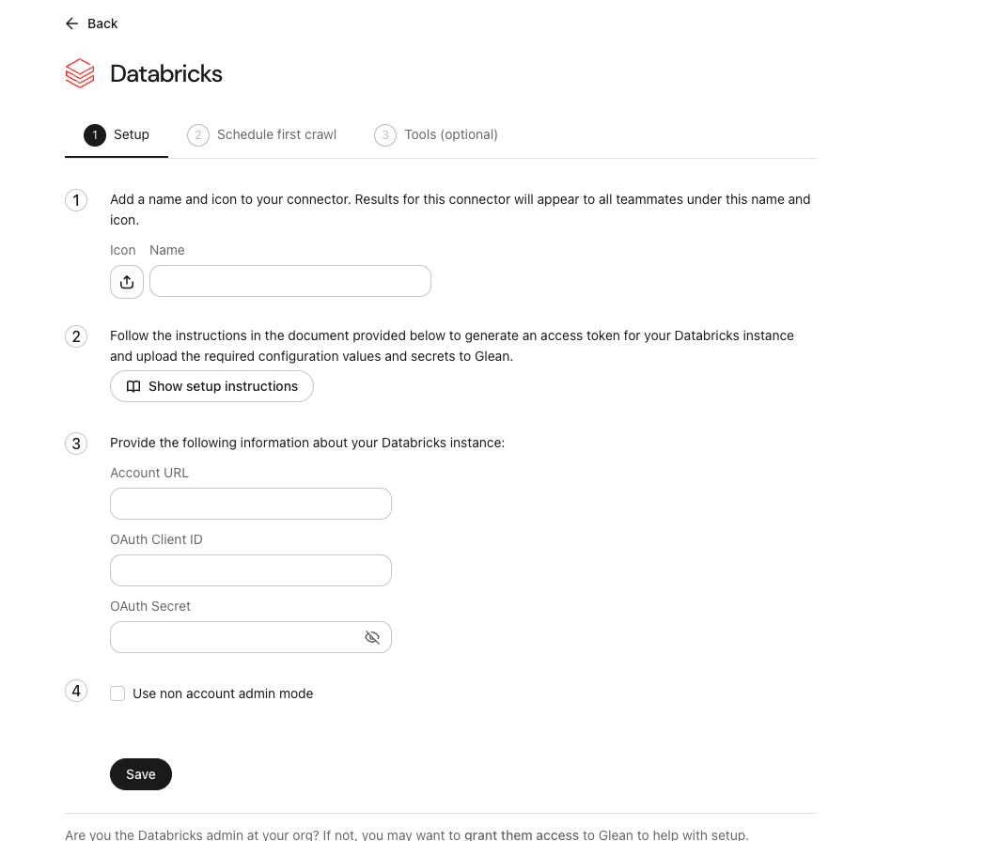
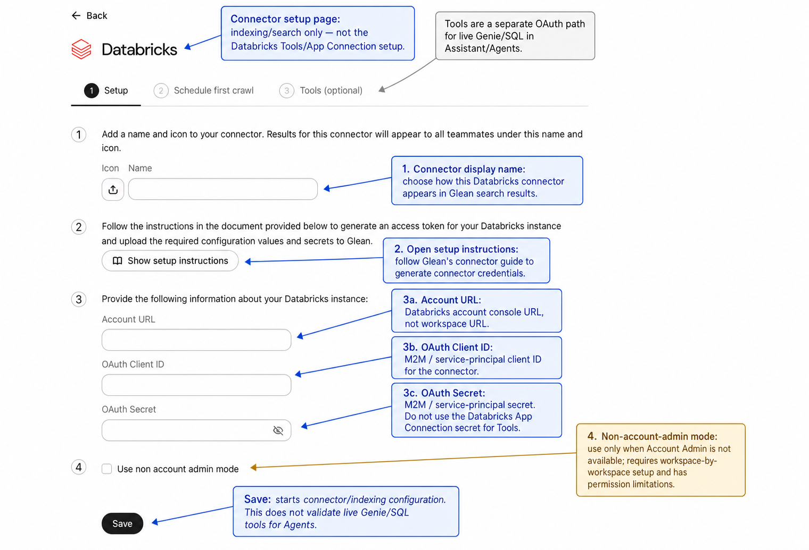
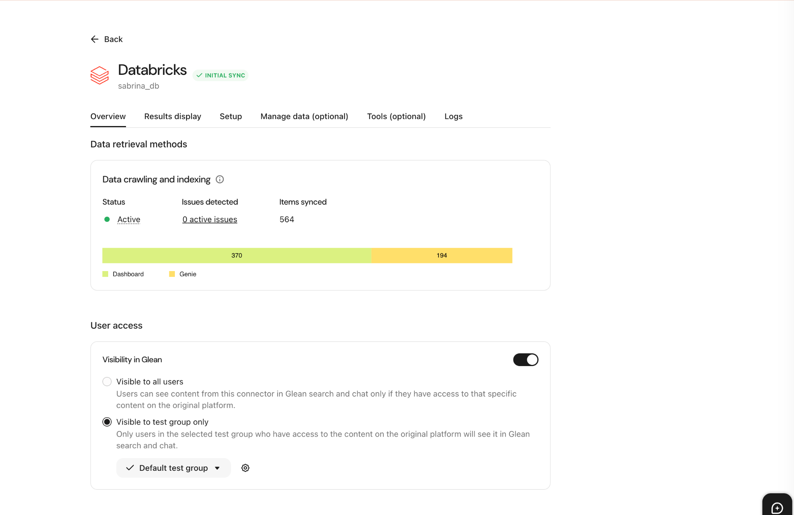
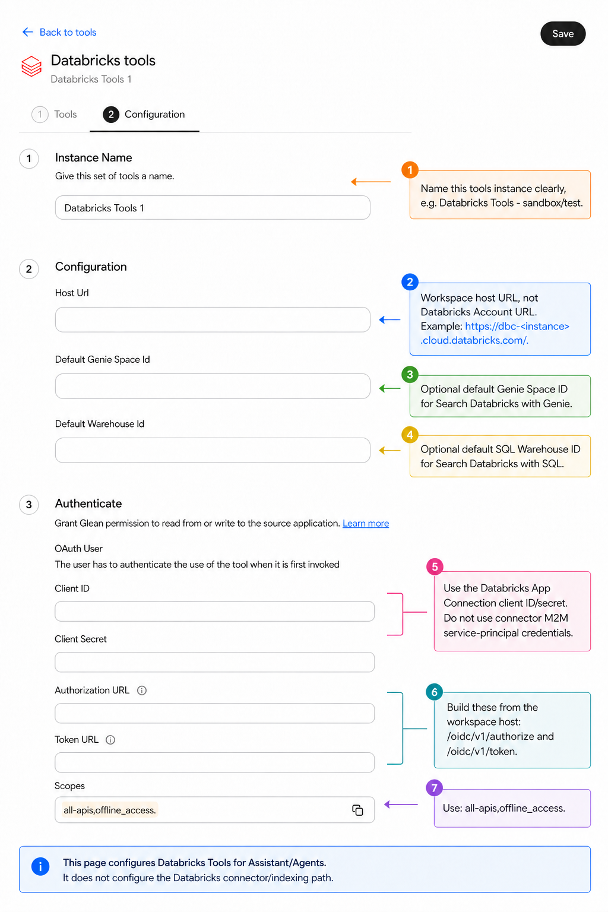
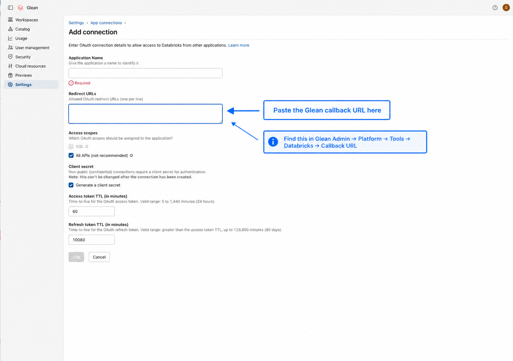
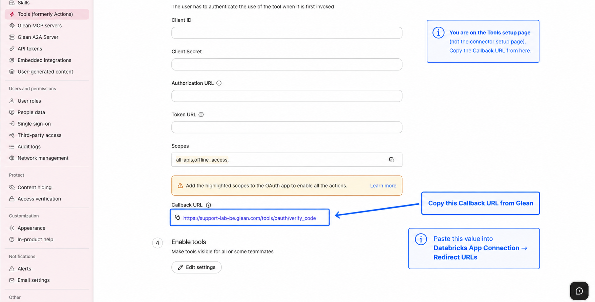
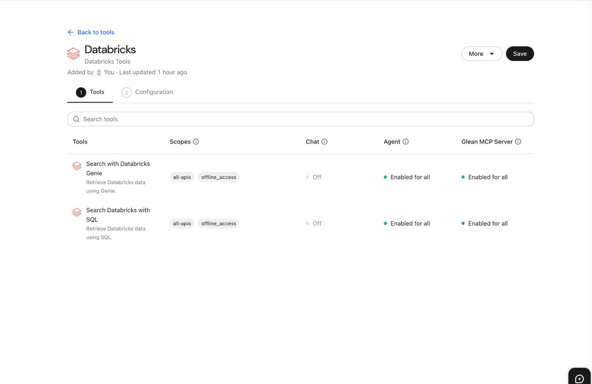

# Databricks in Glean Setup Guide

## Purpose

This guide explains how to set up Databricks in Glean, what access is needed, common pitfalls, and how to validate OAuth before setting up.

## The most important distinction

There are two separate Databricks integrations in Glean, and they use different auth paths:

- The **Databricks connector** is for indexing Databricks content into Glean search and uses **M2M OAuth** with a service principal.
- The **Databricks tools** used in Assistant and Agents use **user OAuth (U2M)** through a Databricks App Connection, and each user must authenticate with their own Databricks credentials when they use the tool.

This distinction matters because a healthy synced connector does **not** prove the Databricks tools are configured correctly.



_Figure 1: Databricks connector setup in Glean, which is separate from the Databricks tools OAuth setup._



_Figure 1b (annotated): The connector setup page handles indexing/search only; the Databricks tools use a separate OAuth path._



_Figure 2: An active Databricks connector with synced items indicates indexing is healthy, but it does not validate the Databricks tools OAuth flow._

## What access is needed

### For the Databricks connector

You need:

- A Databricks service principal and OAuth M2M credentials for the connector (configure in the account console).
- The Databricks **account-level URL**, not the workspace URL, for the connector Account URL field.
- Account Admin is strongly preferred for the recommended account-level configuration. If Account Admin is not available, Glean supports a non-account-admin connector mode, but it has permission limitations and requires workspace-by-workspace setup.

### For Databricks tools in Assistant and Agents

You need:

- Access to the Databricks account console to create an App Connection under **Settings → App Connections**.
- **Account Admin access** in Databricks to see the App Connections tab. In practice, this is a common blocker: the App Connections tab lives under the **Settings gear** in the left sidebar at `accounts.cloud.databricks.com`, not as a top-level navigation item. If the tab does not appear at all, the user likely does not have account admin access and needs someone who does.
- A Databricks **workspace host URL** for the tool Host URL and OAuth endpoints.
- A **Client ID** and **Client Secret** generated from that App Connection.
- Tool access enabled for the right users or groups in Glean.

## What goes where

### Connector fields

Use the connector only if you want Databricks content indexed into Glean search.

- **Account URL:** copy the full URL from the Databricks account console browser bar.
- **OAuth Client ID:** the connector's M2M client ID from the Databricks service principal flow.
- **OAuth Client Secret:** the connector's M2M secret.

### Tool fields

Use the tools if you want Genie or SQL inside Assistant or Agents.

- **Host URL:** the Databricks workspace URL, such as `https://dbc-<instance>.cloud.databricks.com/` for AWS-hosted workspaces.
- **Authorization URL:** `https://<workspace-host>/oidc/v1/authorize`.
- **Token URL:** `https://<workspace-host>/oidc/v1/token`.
- **Scope:** `all-apis,offline_access`.
- **Client ID:** the Databricks App Connection client ID.
- **Client Secret:** the Databricks App Connection client secret.



_Figure 3: Databricks tools configuration in Glean using workspace-based OAuth endpoints. The callback URL format shown here is deployment-specific, so do not copy `support-lab-be.glean.com` literally; always use the exact callback URL generated by your own Glean deployment after saving the tool._

## Recommended setup flow for Databricks tools

### Step 1: Create the Databricks App Connection

In the Databricks account console:

- Go to **Settings → App Connections → Add Connection**.
- Set an application name (such as `Glean Databricks Tools OAuth`).
- Enter a placeholder/dummy redirect URL (e.g. `https://example.com`) for now. Glean generates the real callback URL only after you save the tool (Step 4), so you will return here and update it then.
- Select **All APIs**.
- Check **Generate a Client Secret**.
- Recommended TTLs are **360 minutes** for the access token and **129600 minutes** for the refresh token.
  - Databricks defaults are 60 minutes for access tokens and 10080 minutes for refresh tokens. The longer settings above are recommended in the Glean setup guide to reduce reauthentication churn for tools and background agent use. Align that decision with your own Databricks and Glean admins before changing the values.



_Figure 4: Creating the Databricks App Connection — paste the Glean callback URL into Redirect URLs, select All APIs, and check Generate a client secret._

> _Note: Selecting SQL instead of All APIs is a common misconfiguration when creating the Databricks App Connection._

### Step 2: Capture the secret immediately

After saving the App Connection:

- Copy the **Client ID**.
- Copy the **Client Secret** immediately and store it somewhere safe, because this is the value Glean needs in the tools config.
- If you close the modal without saving the secret, you will not be able to retrieve it later and may need to recreate the App Connection or rotate the secret.

### Step 3: Fill in the Glean tool

In **Glean Admin → Platform → Tools → Databricks Tools**:

- Enter the workspace Host URL.
- Enter the Client ID and Client Secret from the Databricks App Connection.
- Enter the Authorization URL and Token URL based on the workspace host.
- Use scope `all-apis,offline_access`.
- Optionally set a default Genie Space ID and Warehouse ID if you want a default test environment.

### Step 4: Save the tool, then update the redirect URL in Databricks

After saving the tool, copy the generated callback URL back into the Databricks App Connection.



_Copy this callback URL from Glean and paste it into the Databricks App Connection → Redirect URLs._



_Figure 5: Databricks Tools successfully configured._

## Optional: Pre-flight validation

Before testing the browser-based OAuth flow in Glean, you can validate your Databricks configuration using the sample notebooks below.

**Sample notebooks:** https://github.com/sabrina-wang-glean/databricks_connector_setup

The notebooks include examples for validating both authentication flows:

- **Connector (M2M OAuth):** validate your service principal credentials using the client credentials flow.
- **Tools (U2M OAuth):** validate your Databricks App Connection and user OAuth flow.

These notebooks provide a quick sanity check before completing the setup in Glean.

> **Note:** Successfully obtaining a token confirms your Databricks OAuth configuration is working, but it does not replace an end-to-end functional test in Glean.

## Functional test in Glean

After completing the configuration, validate the integration with a simple end-to-end test.

One of the easiest approaches is to create a scratch Agent:

- Create a new Agent.
- Add a single text input named `query`.
- Add a Databricks step using either **Search Databricks with Genie** or **Search Databricks with SQL**.
- Pass `[[query]]` into the Databricks step.
- Add a **Respond** step and test the Agent in Preview.

Alternatively, you can test the Databricks tool directly in Glean Assistant.

## Common pitfalls

### Mixing up connector and tool authentication

The Databricks connector and Databricks tools use different authentication methods:

- **Connector:** service principal (M2M OAuth)
- **Tools:** user OAuth through a Databricks App Connection

A healthy connector sync does not validate the Databricks tools OAuth flow.

### Using the wrong URLs

Use the appropriate URL for each configuration:

- **Connector:** Databricks account URL
- **Tools:** workspace Host URL and workspace OAuth endpoints

### Selecting the wrong API type

When creating the Databricks App Connection, select **All APIs**. Selecting SQL will prevent the Databricks tools from authenticating correctly.

### Losing the client secret

The App Connection client secret is only displayed once. Copy and securely store it immediately after creating the App Connection. If it is lost, you'll need to generate a new secret.

### Redirect URL validation

If Databricks rejects the redirect URL:

- Save the Databricks tool in Glean first to generate the callback URL.
- Copy the generated callback URL into the Databricks App Connection.
- If validation still fails, verify there is no leading or trailing whitespace in the URL.

### "OAuth application not available"

An error similar to:

```
OAuth application with client_id ... not available in Databricks account
```

typically indicates an issue with the Databricks App Connection rather than the connector. Common causes include:

- An incorrect Client ID
- Using credentials from a different Databricks account
- An outdated or rotated client secret

Verify that the App Connection credentials in Glean match those configured in Databricks.

## Public reference links

- Glean Databricks connector
- Glean Databricks tools setup
- Glean Databricks tools overview
- Databricks OAuth (User-to-Machine)
- Databricks OAuth (Machine-to-Machine)
- Databricks App Connections

## Quick summary

- The Databricks connector and Databricks tools are configured separately.
- The connector uses service principal (M2M) authentication.
- The tools use user OAuth through a Databricks App Connection.
- Connector health does not validate the tools OAuth configuration.
- Use the account URL for the connector and the workspace URL for the tools.
- Select All APIs when creating the App Connection.
- If App Connections is unavailable, verify you have Databricks Account Admin access.
- Complete an end-to-end test in Glean after configuration to confirm everything is working.
